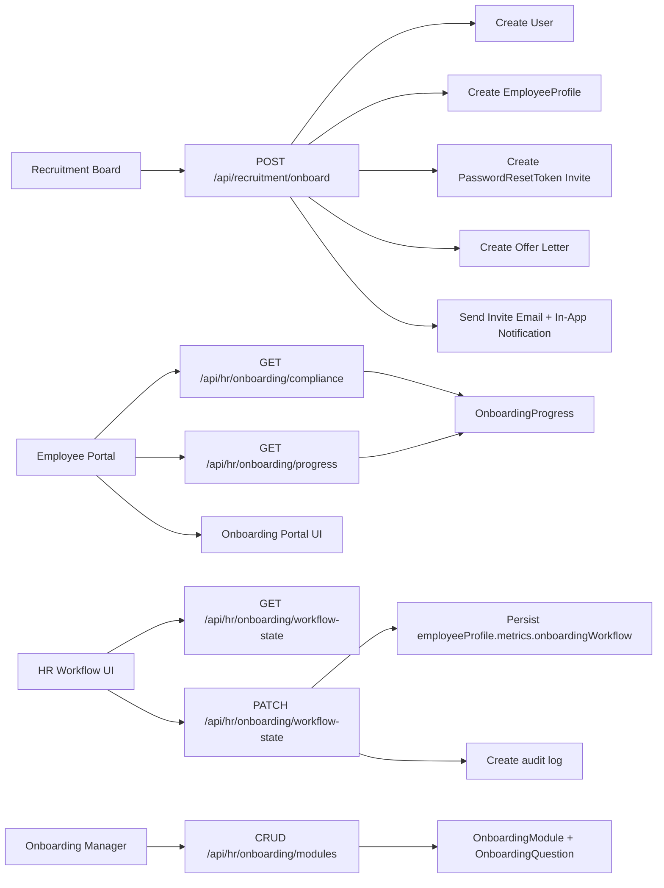

# HR Hiring and Onboarding Architecture

This document describes the current hiring-to-onboarding flow in the IMS workspace after the onboarding fixes.

## Overview

The HR flow now has three cooperating layers:

1. Recruitment turns a selected candidate into a user and employee profile.
2. Onboarding modules track learning progress and compliance for new hires.
3. The employee workflow stores step-by-step onboarding state in `employeeProfile.metrics.onboardingWorkflow`.

`onboardingWorkflow` is the workflow source of truth. It stores the current step, step status, approvals, and per-step detail payloads for things like perks.

## Architecture Diagram

## Data Model

### Recruitment handoff

- `jobApplication.status` moves from `SELECTED` to `ONBOARDED`.
- `user` is created with the new employee identity.
- `employeeProfile` is created alongside the user.
- `passwordResetToken` stores a one-time invite link token for the initial password setup.
- `digitalDocument` stores the generated offer letter if a template exists.

### Onboarding modules

- `onboardingModule` holds reusable content and quiz questions.
- `onboardingProgress` stores module completion and scores.
- Compliance checks use module applicability rules based on:
  - company
  - global modules
  - department
  - role/designation

### Workflow state

`employeeProfile.metrics.onboardingWorkflow` stores:

- `status`
- `statusDetail`
- `currentStep`
- `lastSavedStep`
- `updatedAt`
- `steps.joining`
- `steps.verification`
- `steps.job`
- `steps.perks`

Each step keeps:

- `completed`
- `savedAt`
- `savedBy`
- optional approval fields for reviewable steps
- optional `details` payload for step-specific data

## Workflows

### 1. Candidate becomes employee

1. HR marks a candidate as `SELECTED`.
2. HR triggers onboarding through `POST /api/recruitment/onboard`.
3. The system creates the user and employee profile.
4. The system generates a one-time reset token and sends the invite email.
5. The candidate sets a password on `/reset-password`.
6. The employee logs into the staff portal and continues onboarding.

### 2. Employee onboarding workflow

1. HR opens the workflow screen.
2. Step 1 creates or updates the employee profile.
3. Step 2 stores verification fields.
4. Step 3 stores job details.
5. Step 4 stores perks details inside workflow state.
6. Verification and perks can be approved or rejected by authorized HR/manager roles.
7. The workflow state is persisted and audited after each save or approval.

### 3. Training/compliance flow

1. The staff portal loads module progress.
2. The progress endpoint returns applicable onboarding modules.
3. Employees complete lessons and quizzes.
4. The compliance endpoint checks pending docs and applicable modules only.
5. Completion status is reflected in the portal and onboarding readiness checks.

## Important Endpoint Map

- `POST /api/recruitment/onboard`
- `GET /api/hr/onboarding/progress`
- `POST /api/hr/onboarding/progress`
- `GET /api/hr/onboarding/compliance`
- `GET /api/hr/onboarding/modules`
- `POST /api/hr/onboarding/modules`
- `PATCH /api/hr/onboarding/modules`
- `DELETE /api/hr/onboarding/modules`
- `GET /api/hr/onboarding/workflow-state`
- `PATCH /api/hr/onboarding/workflow-state`

## Notes

- The onboarding invite is now one-time and time-limited instead of a shared yearly password.
- Compliance and progress now use the same applicability rules, so employees are not blocked by unrelated role modules.
- The workflow UI stores perks details inside workflow state instead of splitting them across multiple onboarding keys.
